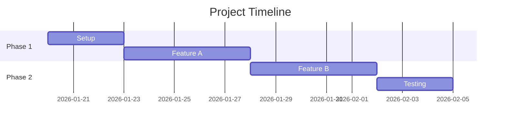

# [Client Name] - [Project Name] Scope Spec

| | |
|---|---|
| **Author** | [Your @losthex.com email] |
| **Date** | [Date] |
| **Teardown** | [Link to TEARDOWN.md] |

---

## Executive Summary

[2-3 sentences: What are we building? What's the outcome? Timeline overview.]

---

## Objectives

What success looks like:

1. [Primary objective]
2. [Secondary objective]
3. [Tertiary objective]

## Success Metrics

How we measure success:

| Metric | Target | How to Measure |
|--------|--------|----------------|
| [Performance] | [e.g., API < 200ms p95] | [Load testing] |
| [Reliability] | [e.g., 99.9% uptime] | [Monitoring] |
| [Adoption] | [e.g., 80% users migrated] | [Analytics] |

## Requirements

### Functional

| ID | Requirement | Priority |
|----|-------------|----------|
| FR-1 | [System shall do X] | Must |
| FR-2 | [System shall do Y] | Must |
| FR-3 | [System shall do Z] | Should |

### Non-Functional

| ID | Requirement | Target |
|----|-------------|--------|
| NFR-1 | Performance | [Response time, throughput] |
| NFR-2 | Scalability | [Concurrent users, data volume] |
| NFR-3 | Security | [Auth, encryption, compliance] |

---

## Scope

### In Scope

| Item | Description |
|------|-------------|
| [Feature/Work Item 1] | [What it includes] |
| [Feature/Work Item 2] | [What it includes] |
| [Feature/Work Item 3] | [What it includes] |

### Out of Scope

| Item | Why |
|------|-----|
| [Excluded item 1] | [Reason - future phase, client owns, etc.] |
| [Excluded item 2] | [Reason] |

### Assumptions

- [Assumption 1 - e.g., "Client provides API credentials by Day 3"]
- [Assumption 2 - e.g., "Existing auth system remains unchanged"]
- [Assumption 3]

---

## Resource Allocation

### Team

| Role | Person | Allocation | Duration |
|------|--------|------------|----------|
| Tech Lead | [Name] | [X hrs/week] | [Weeks] |
| Developer | [Name] | [X hrs/week] | [Weeks] |
| Developer | [Name] | [X hrs/week] | [Weeks] |

### Total Effort

| Metric | Value |
|--------|-------|
| **Total Hours** | [X] |
| **Duration** | [X weeks] |
| **Team Size** | [X people] |

---

## Timeline

### Milestones

| Milestone | Target Date | Deliverable |
|-----------|-------------|-------------|
| Kickoff | [Date] | Project setup, access confirmed |
| M1: [Name] | [Date] | [What's delivered] |
| M2: [Name] | [Date] | [What's delivered] |
| M3: [Name] | [Date] | [What's delivered] |
| Handoff | [Date] | Documentation, training |

### Gantt (Optional)

---

## Deliverables

| # | Deliverable | Format | Owner |
|---|-------------|--------|-------|
| 1 | [Code/Feature] | [GitHub PR] | [LostHex] |
| 2 | [Documentation] | [Markdown in repo] | [LostHex] |
| 3 | [Training] | [Video call] | [LostHex] |

---

## Risks

| Risk | Impact | Likelihood | Mitigation |
|------|--------|------------|------------|
| [Risk 1] | High/Med/Low | High/Med/Low | [How we address it] |
| [Risk 2] | | | |

---

## Dependencies

| Dependency | Owner | Needed By | Status |
|------------|-------|-----------|--------|
| [API access] | [Client] | [Date] | ⏳ Pending |
| [Design specs] | [Client] | [Date] | ✅ Received |

---

## Sign-off

| Party | Name | Date |
|-------|------|------|
| LostHex | | |
| Client | | |

---

## Appendix

### From Teardown

Key findings that shaped this scope:

- [Finding 1 from teardown → how it affects scope]
- [Finding 2 → impact]

### Excluded for Future Phases

| Item | Estimated Effort | Priority |
|------|------------------|----------|
| [Future item 1] | [X hrs] | High/Med/Low |
| [Future item 2] | [X hrs] | |
