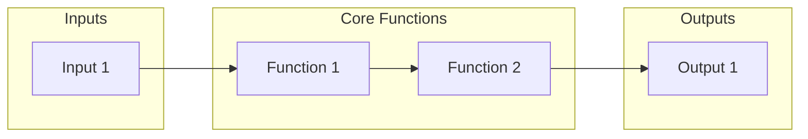
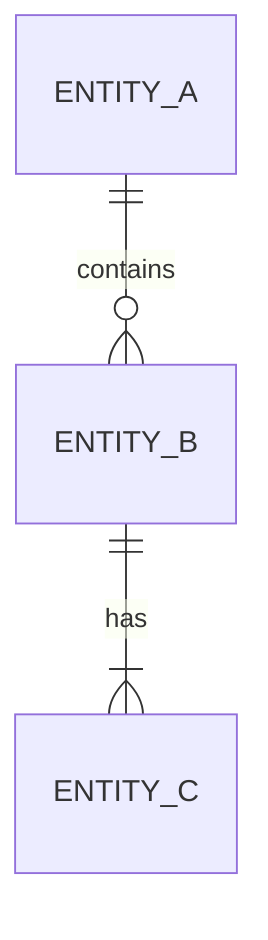

# [Client Name] - [Product/System Name] Teardown Spec

| | |
|---|---|
| **Author** | [Your @losthex.com email] |
| **Started** | [Date] |
| **Submitted** | [Date] |

---

## Change Log

- **Iteration #1:** [HH:MM] - [Changes made]

---

## Spec Summary

### Introduction

[1-3 paragraphs describing what's being torn down. Identify the system/process, its current state, purpose, key components, known issues. Outline scope of the teardown. Focus on "what" - no solutions yet.]

### Inputs

| Input | Reference |
|-------|-----------|
| SME Interview | [Name, role] — [Recording link] |
| Transcript | [`inputs/sme-interview.md`](inputs/sme-interview.md) |
| Codebase | [Repo URL] @ `abc123` |
| AWS | Account `123456789` (read-only) |

### 1-Sentence Goal

[Single sentence: what you aim to accomplish by analyzing this system.]

### Executive Summary

[3-5 key high-level insights and recommendations. Most valuable technical takeaways that inform Discovery. Actionable insights for project direction. This is the primary output for stakeholders.]

---

## Business Context

### Business Problem

[What problem does this system/process solve?]

### Product Solution

[How does the system/process address the business problem?]

### Big Idea

[What makes this system/process unique or valuable?]

### Product Summary

| | |
|---|---|
| **Product Name** | [Official name] |
| **Delivery Model** | [SaaS / on-prem / hybrid] |
| **Life Cycle Stage** | [Development status, market position] |
| **Key Figures** | [Customers, revenue, usage metrics] |

### Competitors

- [Competitor 1]
- [Competitor 2]
- [Competitor 3]

---

## Important Business Decisions

### IBD-1: [One sentence summary]

**THE PROBLEM**

[Business issue being addressed. Market context, customer needs, strategic goals. End with a specific question.]

**OPTIONS CONSIDERED**

1. [First option]
2. **[Selected option]**
3. [Other options]

**REASONING**

[Why selected option was chosen. Business value, market factors, customer impact, financial implications.]

**IMPLICATIONS**

- [Impact on user experience]
- [Revenue/cost implications]
- [Market positioning]

**BUSINESS ASSESSMENT**

> [State clearly: "This decision remains valid" OR "This decision should be reconsidered"]
>
> [Assess from CEO/Owner perspective based on current market conditions. If recommending reconsideration, explain preferred approach.]

---

## System Model

### Inputs

- [What goes into the system]

### Outputs

- [What comes out]

### Controls

- [Settings/parameters that affect transformation]

### Core Functions

- [CF-1: How inputs transform to outputs]
- [CF-2: ...]
- [CF-3: ...]

---

## Whiteboard Diagram

[High-level visual of key components and relationships. 7-10 boxes max. Show flow from inputs → core functions → outputs.]

**Link to Excalidraw:** [Insert immutable sharing link]

---

## Data Structures

### Overview

[Product-level view of data and how it's used. Multi-tenancy details if relevant.]

### Core Entities

[Concise descriptions of objects and relations. Bold **entity names**, italicize *field names*.]

### CUD Operations

- [What creates/updates/deletes main entities]
- [Be specific: component, action, entities affected]

### Query Patterns

- [Main query patterns, who uses them, purpose]

### Persistence

- [How data is persisted: DB type, version, storage]

### Metrics

- [Data volume, throughput, latency, SLAs]

---

## Topics

[One section per Core Function. Each contains background + technical decisions.]

### 1. [Core Function Name]

[2-3 paragraphs: what it does, why it exists, role in transformation.]

#### ITD-1.1: [One sentence summary]

**THE PROBLEM**

[Technical issue being addressed. Ask "curious questions" to find real problem. End with specific question.]

**OPTIONS CONSIDERED**

1. [First option - if unknown for teardown, say so]
2. **[Selected/observed option]**
3. [Other options]

**REASONING**

[Why this approach was chosen. Key factors, trade-offs, assumptions.]

**IMPLICATIONS**

- [Timeline/budget impact]
- [Dependencies created]
- [Risks introduced/mitigated]

**REBUILD ASSESSMENT**

> **Would we make this decision again?** [Yes / No]
>
> [If Yes: Explain why it remains valid]
>
> [If No: Was it right at the time? What would we do today instead?]
>
> *Many "No" assessments signal significant technical debt and architectural concerns.*

---

### 2. [Next Core Function]

[Repeat structure...]

---

## Appendix

[Additional context, credentials needed, setup instructions]
