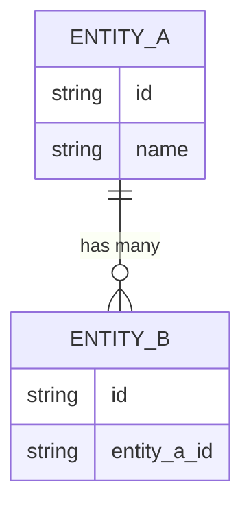

# DS-XXX: [Data Structure Name]

> **Naming**: Use format `DS-NNN-structure-name.md` (sequential numbering with descriptive name)

## Overview

[Briefly summarize the important points about the data relevant to this structure. Detailed descriptions of specific objects and relations belong in Core Entities—this section provides the product-level view of the data and how it is used.]

- **Services:** [Which services own/manage this data]
- **Key Architectural Decisions:** [Link to relevant ITDs]

## Core Entities

[Insert logical model diagram(s) with the most important objects, relations, and fields. This includes all types of persisted data—database, file system, documents, etc.

Include multi-tenancy details if relevant—per-tenant qualifier fields, per-tenant tables, etc.

Use ER-style diagrams with crow's-foot notation for cardinality:]

[Include concise textual descriptions to explain the objects and their relations.

When referring to entities, use their exact names and **bold** them, e.g. "each **Message** is contained in a **Thread**". Field names should be *italicized*, e.g. "the *topic* field is optional".]

### Key Fields (Optional)

[For complex entities, a table of key fields (not all fields) can help clarify the model:]

| Entity | Field | Type | Description |
|--------|-------|------|-------------|
| **EntityName** | *fieldName* | string | What this field represents |

## CUD Operations

[What causes the main entities to be created, updated, and deleted? Include all relevant flows: data transformations, API calls, external events, UI interactions, etc.

Be specific about the component performing the action, what is being done, and to which entities. Use active voice (subject-verb-object), e.g.:

- The user creates **JobConfig** objects using the admin UI.
- Clients submit call records to the API, which writes them to the **Log** table and updates the **User**.*lastCall* time.
- The Archive job runs weekly and deletes **CallRecords** older than 1 year.
- A sync script reads markdown from GitHub, transforms it, and updates the **GoogleDoc**.]

## Access Patterns

[What are the main query/access patterns used? e.g.:

- Insight jobs run nightly to aggregate **DocumentAccess** events and update the *readerCount* for each **Document**.
- The Rating Engine queries the **Charging** table 1000s of times/sec to check charging for each outbound call.
- Engineers read **ITD** documents by browsing the repository or searching by category.]

## Persistence

[Summarize how the data is persisted. Include relevant location, version, and format details, e.g.:

- **Organization**, **Agent** and associated objects are stored in MySQL 5.7.10 (InnoDB engine) on EBS volumes.
- Event logs are stored in S3 with Hive-based partitioning by date.
- **ITD** and **Spec** documents are stored as markdown files in GitHub repositories.]

## Metrics (Optional)

[Key facts about data volume, throughput, latency, and SLAs/SLOs, e.g.:

- The log **Events** stored in S3 average 30GB per customer, totaling 421GB as of Nov 2020, growing 220MB/day.
- The MySQL database averages 800 QPS, with p99 of 3,200 QPS during weekday afternoons.
- SLAs require queries to complete in < 50ms; median latency is 23ms but p95 is over 200ms.]

## Related Documentation

- [Link to relevant ITDs and other documentation]

---

## Tips

### Rendering Check

- **Use Google Docs preview** to verify your document renders correctly before finalizing
- Markdown rendering can vary between platforms — visual review catches issues linters miss
