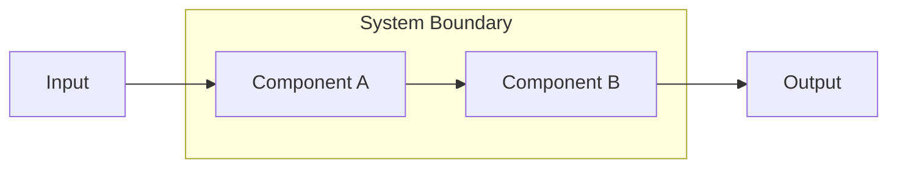

# SPEC-XXX: [Project Name]

| | |
|---|---|
| **Author** | [Name] |
| **Date** | [Month Year] |
| **Client** | [Client name, if applicable] |
| **Changelog** | • [YYYY-MM-DD]: [Change description] |

---

> **Naming**: Use format `SPEC-NNN-descriptive-name.md` (sequential numbering with descriptive name)

## Introduction

[Brief introduction to the project. What is this about?]

**Business Context:** [Why are we building this? What problem does it solve for users/business?]

**In Scope:**

- [What this spec covers]
- [Systems, features, or decisions included]

**Out of Scope:**

- [What is explicitly NOT covered]
- [Related work that belongs elsewhere]

## Solution Overview

[Executive summary of the technical approach. This is the "elevator pitch" for how we're solving the problem. Explain what's special about this solution and key insights that shaped it.

This section should tell a story: what problems led to this solution, what makes it effective, and why these choices make sense together.]

## Solution Diagram

[High-level visual showing the system shape—the whiteboard sketch that orients readers]

## Black-Box Model

| Inputs | Outputs | Controls |
|--------|---------|----------|
| [What goes in] | [What comes out] | [Constraints governing transformation] |
| [Another input] | [Another output] | [ITD or principle that constrains] |

## Topics & Core Functions

| Name | Description |
|------|-------------|
| [Topic/Function 1] | [One-sentence description of what this covers] |
| [Topic/Function 2] | [One-sentence description of what this covers] |
| [Topic/Function 3] | [One-sentence description of what this covers] |

---

## [Topic/Function 1]

[Executive summary of this topic—2-3 sentences providing context and key takeaways]

### ITDs

- **[CATEGORY-ITD-NNN](path/to/itd.md)**: [One-sentence description of the decision]

### Data Structures

- **[DS-NNN](path/to/ds.md)**: [One-sentence description of the data structure]

---

## [Topic/Function 2]

[Executive summary of this topic]

### ITDs

- **[CATEGORY-ITD-NNN](path/to/itd.md)**: [One-sentence description]

---

## Core Data Structures

[Brief intro explaining what data models are central to this system]

| Data Structure | Description |
|----------------|-------------|
| [DS-NNN: Name](path/to/ds.md) | [One-sentence summary of key insight] |
| [DS-NNN: Name](path/to/ds.md) | [One-sentence summary] |

---

## Success Metrics (Optional)

[How will you know if the solution is working? Define measurable targets with clear measurement methods.]

| Metric | Target | How to Measure |
|--------|--------|----------------|
| [Metric name] | [Specific target] | [Measurement method] |
| [Metric name] | [Specific target] | [Measurement method] |

---

## Tips for Writing Good Specs

### Solution Overview

- Tell a story: problems → approach → why it works
- Highlight what's special—not just what, but why these choices
- Avoid listing features; provide narrative context
- Keep it executive-level: someone should understand the approach without reading every ITD

### Black-Box Model

- Inputs: What the system receives (data, events, requests)
- Outputs: What the system produces (artifacts, responses, side effects)
- Controls: Constraints that govern how inputs become outputs (ITDs, principles, regulations)

### Topics & Core Functions

- **Topics** = cross-cutting concerns (e.g., Security, Performance, Tooling)
- **Core Functions** = what the system does (e.g., Authentication, Data Sync)
- Each should have ITDs and/or data structures linked
- Include one-sentence descriptions to orient readers

### Sections

- Each section gets an executive summary (2-3 sentences)
- Link to ITDs and data structures—don't embed them
- Keep narrative brief; detailed reasoning lives in ITDs
