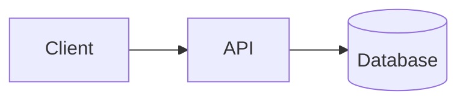
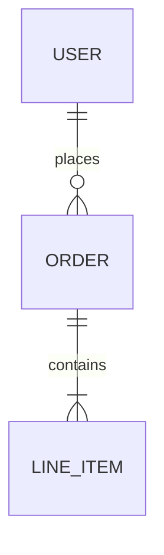

# TEARDOWN-XXX: [System/Project Name]

| | |
|---|---|
| **Author** | [Name] |
| **Date** | [Month Year] |
| **Client** | [Client name] |
| **Source** | [How we got access - repo URL, credentials, etc.] |

---

## Executive Summary

[2-3 sentences: What is this system? What's the bottom line assessment?]

**Overall Health:** [🟢 Good / 🟡 Needs Work / 🔴 Problematic]

## System Overview

### What It Does

[Brief description of the system's purpose and main functionality]

### Tech Stack

| Layer | Technology |
|-------|------------|
| Frontend | [e.g., React 18, Next.js 14] |
| Backend | [e.g., Node.js, Express] |
| Database | [e.g., PostgreSQL 15] |
| Infrastructure | [e.g., AWS, Vercel] |
| Auth | [e.g., Auth0, custom JWT] |

### Architecture Diagram



## Code Quality Assessment

### Strengths

- [What's done well]
- [Good patterns or practices observed]

### Concerns

- [Technical debt]
- [Security issues]
- [Scalability problems]
- [Missing tests]

### Dependency Health

| Status | Count | Notes |
|--------|-------|-------|
| 🟢 Up to date | X | |
| 🟡 Minor updates | X | |
| 🔴 Major/Security | X | [List critical ones] |

## Data Model

[Key entities and relationships. ER diagram if helpful.]



## Key Findings

### [Finding 1: Title]

**Impact:** [High/Medium/Low]

[Description of the finding and why it matters]

### [Finding 2: Title]

**Impact:** [High/Medium/Low]

[Description]

## Recommendations

| Priority | Recommendation | Effort |
|----------|----------------|--------|
| 🔴 Critical | [What to fix first] | [S/M/L] |
| 🟡 Important | [What to address soon] | [S/M/L] |
| 🟢 Nice to have | [Future improvements] | [S/M/L] |

## Questions for Client

- [Things we couldn't determine from code alone]
- [Clarifications needed]
- [Access we still need]

## Appendix

### How to Run Locally

```bash
# Steps to get the system running
```

### Credentials/Access Needed

- [ ] [Repository access]
- [ ] [Database access]
- [ ] [Third-party service credentials]

---

## Tips for Writing Teardowns

### Executive Summary

- Lead with the verdict—don't bury it
- Be honest about health assessment
- Client will read this first (maybe only this)

### Tech Stack

- Be specific about versions
- Note anything unusual or outdated

### Concerns

- Prioritize by impact
- Include evidence (file paths, metrics)
- Don't just list problems—explain why they matter

### Recommendations

- Be actionable
- Include effort estimates
- Separate "must fix" from "nice to have"
