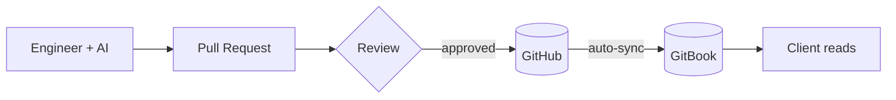

# LostHex Spec Framework

| | |
|---|---|
| **Owner** | Engineering |
| **Last Updated** | January 2026 |

---

## Purpose

Build-phase documentation that engineers actually use. Discovery specs (Google Docs) work for sales but rot after kickoff. This framework keeps specs alive during build—in the repo, readable by AI, updated as we go.

## How It Works

1. Engineer drafts spec from template (AI assists)
2. PR review catches gaps
3. Merge to main → GitBook syncs
4. Client reads polished docs without GitHub access

## Three Document Types

| Type | What It Is | Example |
|------|------------|---------|
| **Spec** | Project narrative (what + why) | `SPEC-001-client-portal.md` |
| **ITD** | Technical decision record | `AUTH-ITD-001-session-storage.md` |
| **Data Structure** | Entity documentation | `DS-001-user.md` |

## What's In / Out

**In scope:**

- Build-phase specs (live in repo, used during development)
- Technical decisions (ITDs)
- Data models (Data Structures)
- Client delivery (GitBook sync)

**Out of scope:**

- Discovery documentation (teardowns, SME interviews, scope docs)
- Sales artifacts
- Project management

## Documentation

→ [SPEC-000: Framework Spec](specs/SPEC-000-losthex-spec-framework.md) — full details, all ITDs
