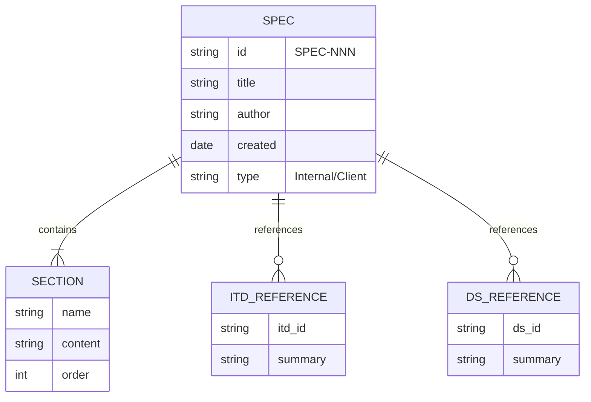

# DS-000: Spec Structure

## Overview

A **Spec** is a project-level document that provides narrative context for technical work. Specs tie together requirements, decisions, and architecture into a coherent story that clients and engineers can follow.

- **Services:** Documentation tooling (markdownlint, Vale)
- **Key Architectural Decisions:** [FOUNDATION-ITD-000](../itds/00-foundation/FOUNDATION-ITD-000-spec-definition.md)

## Core Entities

A **Spec** contains multiple **Sections** in a defined order. Specs reference **ITDs** for technical decisions and **Data Structures** for entity models.

### Required Sections

| Section | Purpose | Content |
|---------|---------|---------|
| **Introduction** | Set context | Business context, scope (in/out) |
| **Solution Overview** | High-level approach | Summary of the solution |
| **Solution Diagram** | Visual architecture | Mermaid flowchart |
| **Black-Box Model** | System boundaries | Inputs, outputs, controls |
| **Topics & Core Functions** | Detailed breakdown | Topic sections with ITD summaries |

### Optional Sections

| Section | Purpose |
|---------|---------|
| **Success Metrics** | How to measure success |
| **References** | External links and resources |

## CUD Operations

- **Create:** TPM copies `spec-template.md` and fills in project details
- **Update:** Authors edit markdown, submit PR for review
- **Delete:** Rare—we archive specs rather than delete them

### Typical Flow

1. TPM creates spec from template
2. AI assistant (Cursor/Claude) generates first draft
3. Author refines and submits PR
4. Reviewer provides feedback
5. Author addresses feedback, iterates
6. Merge to main triggers GitBook sync

## Access Patterns

- Engineers read specs in GitHub or IDE (Cursor)
- Clients read specs via GitBook share links
- AI tools read specs for context during development
- Search by project name or SPEC-NNN identifier

## Persistence

- **Specs** live as markdown files in GitHub repositories
- Path pattern: `docs/specs/SPEC-NNN-project-name.md`
- Version history tracked by Git
- GitBook mirrors published specs for client access

## Related Documentation

- [FOUNDATION-ITD-000: What is a Spec?](../itds/00-foundation/FOUNDATION-ITD-000-spec-definition.md)
- [Spec Template](../../docs/templates/spec-template.md)
