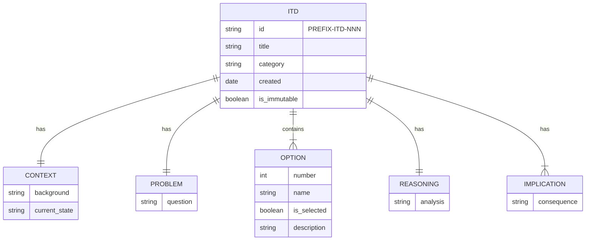

# DS-001: ITD Structure

## Overview

An **ITD** (Important Technical Decision) documents a real decision that is technical in nature and hard to change. ITDs are standalone, reusable, and quick to write—especially with AI assistance.

- **Services:** Documentation tooling (markdownlint with custom rules, Vale)
- **Key Architectural Decisions:** [FOUNDATION-ITD-002](../itds/00-foundation/FOUNDATION-ITD-002-standalone-itds.md)

## Core Entities



An **ITD** has exactly one **Context**, one **Problem**, multiple **Options** (one selected), one **Reasoning** section, and multiple **Implications**.

### Required Sections

| Section | Purpose | Quality Bar |
|---------|---------|-------------|
| **CONTEXT** | Neutral background | No bias toward any option |
| **PROBLEM** | The question | Framed as a question |
| **OPTIONS CONSIDERED** | Alternatives | At least 2 options, one marked ✅ |
| **REASONING** | Why we chose | Analysis of each option |
| **IMPLICATIONS** | Consequences | What follows from the decision |

### Naming Convention

We group ITDs by topic folder. The folder name becomes the prefix:

```text
itds/
├── 00-foundation/
│   └── FOUNDATION-ITD-001-decision-name.md
├── 01-process/
│   └── PROCESS-ITD-001-decision-name.md
└── 02-authoring/
    └── AUTHORING-ITD-001-decision-name.md
```

## CUD Operations

- **Create:** Author copies `itd-template.md`, places in appropriate category folder
- **Update:** Rarely—ITDs are immutable once merged. Create new ITD to supersede.
- **Delete:** Never—ITDs are historical records

### Typical Flow

1. Author identifies decision point
2. Creates ITD from template in category folder
3. Documents context neutrally (no leading)
4. Lists all viable options on equal footing
5. Marks selected option with ✅ and **bold**
6. Explains reasoning for each option
7. Lists implications of the chosen option
8. Submits PR for review

## Access Patterns

- Engineers read ITDs to understand past decisions
- Specs reference ITDs via relative links
- AI tools read ITDs for architectural context
- Search by category prefix (e.g., `FOUNDATION-ITD-*`)

## Persistence

- **ITDs** live as markdown files in GitHub repositories
- Path pattern: `docs/itds/{category}/{PREFIX}-ITD-NNN-decision-name.md`
- Once merged, content is immutable (create new ITD to change direction)
- Version history tracked by Git

## Lint Rules

Custom markdownlint rules enforce ITD structure:

| Rule | Validates |
|------|-----------|
| `itd-required-sections` | All five sections present |
| `itd-valid-sections` | No unexpected sections |
| `itd-single-selected-option` | Exactly one ✅ option |
| `itd-naming-convention` | Title matches folder prefix |

## Related Documentation

- [FOUNDATION-ITD-002: Standalone ITDs](../itds/00-foundation/FOUNDATION-ITD-002-standalone-itds.md)
- [ITD Template](../../docs/templates/itd-template.md)
