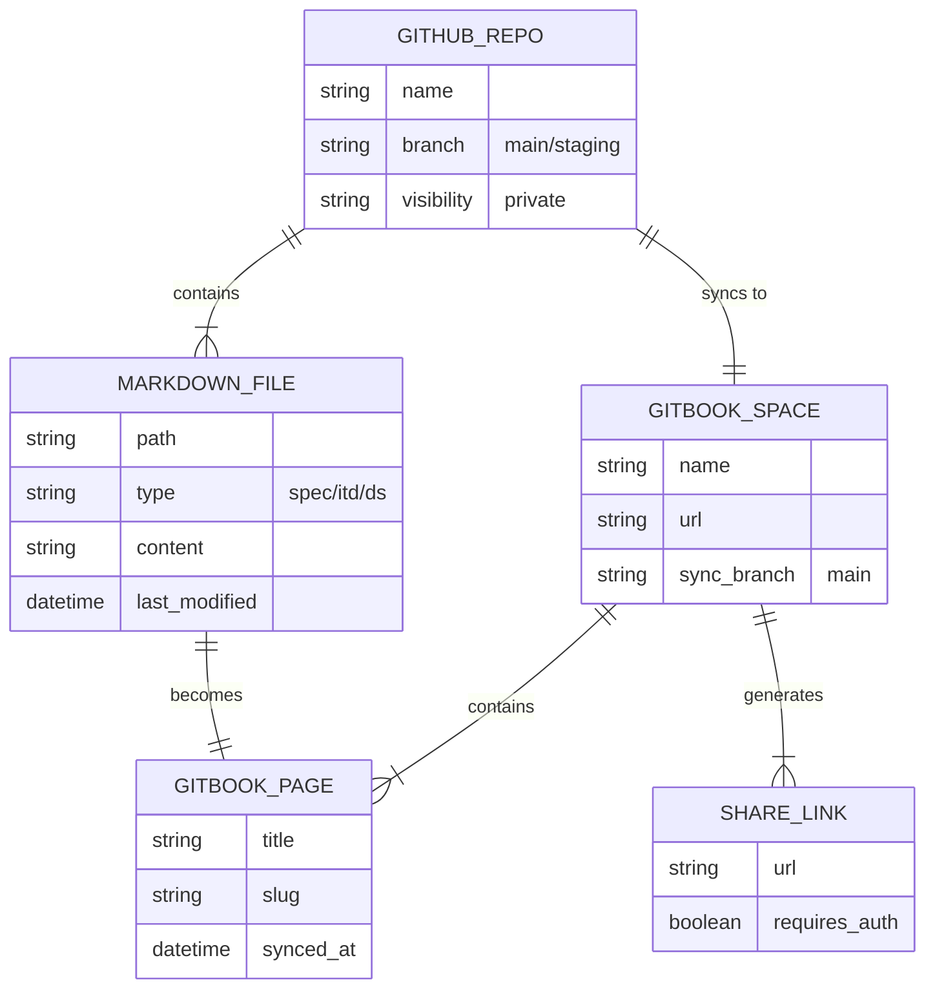

# DS-002: Documentation Platform

## Overview

The documentation platform defines where docs live (GitHub) and how they flow to clients (GitBook). GitHub is the source of truth; GitBook provides client-facing access.

- **Services:** GitHub, GitBook, GitHub Actions
- **Key Architectural Decisions:** [FOUNDATION-ITD-001](../itds/00-foundation/FOUNDATION-ITD-001-documentation-platform.md)

## Core Entities



**GitHub Repo** contains **Markdown Files** that sync to a **GitBook Space**. Each markdown file becomes a **GitBook Page**. The space generates **Share Links** for client access.

### Sync Configuration

Two files control GitBook sync:

| File | Purpose |
|------|---------|
| `.gitbook.yaml` | Root directory, summary file location |
| `SUMMARY.md` | Navigation structure, which files to publish |

## CUD Operations

- **Create:** Author creates markdown file in GitHub, GitBook syncs automatically
- **Update:** Author edits markdown, pushes to main, GitBook updates within minutes
- **Delete:** Author deletes file from GitHub, GitBook removes page on sync

### Sync Flow


1. Author pushes changes to `main` branch
2. GitHub triggers webhook to GitBook
3. GitBook pulls latest content
4. Pages rebuild (2-3 minutes)
5. Client sees updated docs via share link

## Access Patterns

### Internal (Engineers)

- Read/write via GitHub (PRs, direct commits)
- Read via IDE (Cursor, VS Code)
- Search via GitHub search or `grep`

### External (Clients)

- Read-only via GitBook share links
- No GitHub account required
- Comments via email/Slack (not in GitBook on free tier)

## Persistence

| Layer | Storage | Purpose |
|-------|---------|---------|
| **Source of Truth** | GitHub repository | Authoring, version control, review |
| **Client Access** | GitBook | Read-only published docs |
| **Local** | Developer machines | Active editing |

### GitHub Structure

```text
project-repo/
├── docs/
│   ├── specs/
│   │   └── SPEC-001-project.md
│   ├── itds/
│   │   └── 00-foundation/
│   │       └── FOUNDATION-ITD-001-decision.md
│   └── core-data-structures/
│       └── DS-001-entity.md
├── SUMMARY.md          # GitBook nav
└── .gitbook.yaml       # GitBook config
```

## Quality Gates

Documentation flows through quality gates before reaching clients:

| Gate | Tool | Enforces |
|------|------|----------|
| Pre-push | Husky | Markdown lint locally |
| CI | GitHub Actions | All lints + typecheck |
| Review | PR process | Human quality check |
| Publish | GitBook sync | Only `main` branch publishes |

## Related Documentation

- [FOUNDATION-ITD-001: Documentation Platform](../itds/00-foundation/FOUNDATION-ITD-001-documentation-platform.md)
- [GitBook Configuration](../../.gitbook.yaml)
