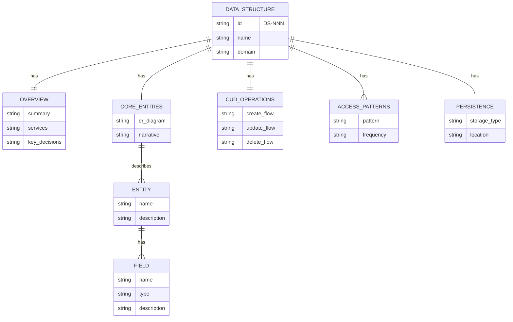
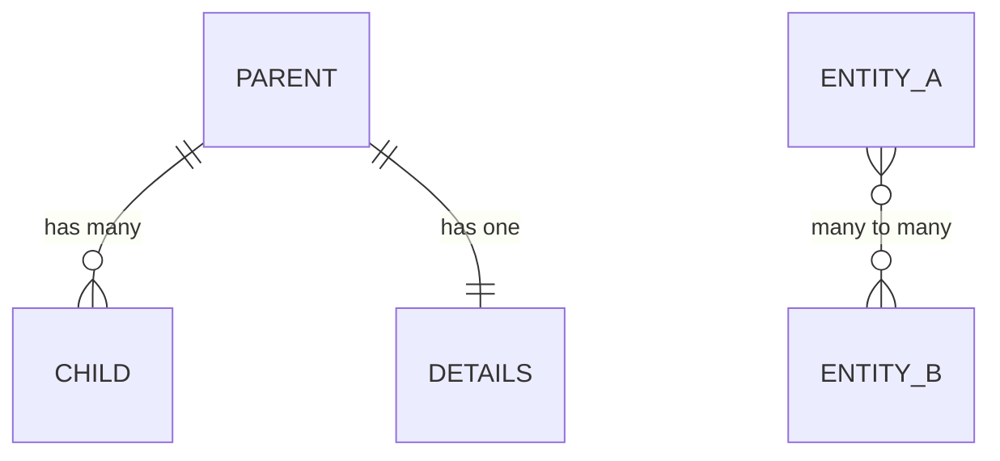

# DS-003: Data Structure Schema

## Overview

A **Data Structure** document describes the data model for a domain. This is meta-documentation: a data structure that defines what data structure documents contain.

- **Services:** Documentation tooling (markdownlint with custom rules)
- **Key Architectural Decisions:** [FOUNDATION-ITD-003](../itds/00-foundation/FOUNDATION-ITD-003-data-structures-first-class.md)

## Core Entities



A **Data Structure** document has an **Overview**, **Core Entities** section with ER diagram and narrative, **CUD Operations**, **Access Patterns**, and **Persistence** details.

### Required Sections

| Section | Purpose | Content |
|---------|---------|---------|
| **Overview** | Context | Services, related ITDs |
| **Core Entities** | Data model | ER diagram + entity descriptions |
| **CUD Operations** | Data lifecycle | Create, update, delete flows |
| **Access Patterns** | Query patterns | Read and query flows |
| **Persistence** | Storage | Storage location and format |

### Optional Sections

| Section | Purpose |
|---------|---------|
| **Key Fields** | Table of important fields for complex entities |
| **Metrics** | Volume, throughput, latency data |
| **Related Documentation** | Links to ITDs, other DS docs |

## CUD Operations

- **Create:** Author copies `data-structure-template.md` for new domain
- **Update:** Authors edit as domain model evolves
- **Delete:** Rare—deprecate and supersede with new DS

### Organization

Organize data structures by aggregate root. Child entities belong in the same document as their root:

```text
core-data-structures/
├── DS-001-user.md           # User + Profile + Settings
├── DS-002-project.md        # Project + Task + Comment
└── DS-003-billing.md        # Invoice + LineItem + Payment
```

## Access Patterns

- Engineers read DS docs to understand domain models
- Specs reference DS docs for entity context
- AI tools use DS docs to understand data relationships
- Search by domain name or DS-NNN identifier

## Persistence

- **Data Structure** documents live as markdown in GitHub
- Path pattern: `docs/core-data-structures/DS-NNN-domain-name.md`
- Version history tracked by Git

## ER Diagram Standards

Use Mermaid `erDiagram` with crow's foot notation:



| Symbol | Meaning |
|--------|---------|
| `\|\|` | Exactly one |
| `o\|` | Zero or one |
| `\|{` | One or many |
| `o{` | Zero or many |

### Entity Naming

- Use **bold** for entity names: "each **User** has a **Profile**"
- Use *italics* for field names: "the *email* field is unique"
- Use UPPER_SNAKE_CASE in diagrams: `USER`, `USER_PROFILE`

## Lint Rules

Custom markdownlint rules enforce DS structure:

| Rule | Validates |
|------|-----------|
| `ds-required-sections` | Overview section present |

## Related Documentation

- [FOUNDATION-ITD-003: Data Structures First Class](../itds/00-foundation/FOUNDATION-ITD-003-data-structures-first-class.md)
- [Data Structure Template](../../docs/templates/data-structure-template.md)
