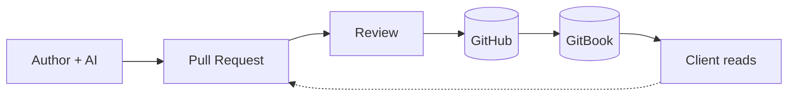

# SPEC-000: LostHex Spec Framework

| | |
|---|---|
| **Author** | Vice Šimunov |
| **Date** | January 2026 |
| **Changelog** | • 2026-01-15: Simplified spec, honest context |

---

## Business Context

LostHex stalled in 2025. We had specs—detailed discovery documents in Google Docs—but they lived in a silo. TPMs wrote them, clients approved them, then engineers built without referencing them. The specs helped sell projects but didn't help build them.

TPMs are our bottleneck. They're rare, expensive, and can't scale with the team. When specs require a TPM to write and maintain, they become artifacts that rot after kickoff.

Now we're ramping up with 3 new client engagements in Q1 2026. We need specs that:

- **Engineers actually use** — Live in the repo, readable by AI tools, updated as we build
- **Don't require TPMs** — Any senior dev can write and maintain them
- **Scale with part-time teams** — People come and go; docs transfer knowledge
- **Ship fast** — Templates + AI = hours, not days

## Scope

**Problems we're solving:**

- Discovery specs don't translate to build (Google Docs rot after kickoff)
- No build-phase documentation (engineers wing it or dig through Slack)
- Technical decisions scattered in calls, Slack, heads
- Clients can't access GitHub (need a reading layer)

**Not solving:**

- Discovery documentation (teardowns, SME interviews, scope docs) — separate process, likely a `losthex-playbook` repo
- Migration of old Google Docs specs
- Complex approval workflows

## What is a Spec?

**A Spec describes what we're building and why.**

One document type. It covers:

- **What** the system does (boundaries, inputs, outputs)
- **Why** we're building it (business context)
- **What we decided** (links to ITDs)
- **What data** it manages (links to Data Structures)

When someone asks "what are we building?"—point them to the Spec.

## Three Document Types

| Type | Purpose | Lives Where |
|------|---------|-------------|
| **Spec** | Project narrative | `docs/specs/` |
| **ITD** | Technical decision record | `docs/itds/` or `framework/itds/` |
| **Data Structure** | Entity documentation | `docs/core-data-structures/` |

Specs reference ITDs and Data Structures. ITDs and Data Structures can exist independently.

## How It Works

1. Author drafts spec using template + AI
2. Submit PR for review
3. Address feedback, iterate
4. Merge to main → GitBook auto-syncs
5. Client reads on GitBook, feedback loops back via new PRs

## Decisions

The framework's design choices live in ITDs:

### Foundation

| ITD | Decision |
|-----|----------|
| [FOUNDATION-ITD-000](../itds/00-foundation/FOUNDATION-ITD-000-spec-definition.md) | Specs provide narrative; ITDs are standalone |
| [FOUNDATION-ITD-001](../itds/00-foundation/FOUNDATION-ITD-001-documentation-platform.md) | GitHub as source of truth |
| [FOUNDATION-ITD-002](../itds/00-foundation/FOUNDATION-ITD-002-standalone-itds.md) | ITDs reusable across projects |
| [FOUNDATION-ITD-003](../itds/00-foundation/FOUNDATION-ITD-003-data-structures-first-class.md) | Data structures as first-class docs |

### Authoring

| ITD | Decision |
|-----|----------|
| [AUTHORING-ITD-001](../itds/02-authoring/AUTHORING-ITD-001-ai-assisted-documentation.md) | AI encouraged, humans accountable |
| [AUTHORING-ITD-002](../itds/02-authoring/AUTHORING-ITD-002-data-structure-organization.md) | Group data structures by aggregate root |

### Process

| ITD | Decision |
|-----|----------|
| [PROCESS-ITD-001](../itds/01-process/PROCESS-ITD-001-review-standards.md) | Quality bar and review mechanics |

### Tooling

| ITD | Decision |
|-----|----------|
| [TOOLING-ITD-001](../itds/03-tooling/TOOLING-ITD-001-gitbook-sync.md) | GitBook for client visibility |
| [TOOLING-ITD-002](../itds/03-tooling/TOOLING-ITD-002-markdown-linting.md) | Markdownlint + Vale for quality |
| [TOOLING-ITD-003](../itds/03-tooling/TOOLING-ITD-003-custom-spec-rules.md) | Custom lint rules per doc type |
| [TOOLING-ITD-004](../itds/03-tooling/TOOLING-ITD-004-ai-tooling.md) | No mandated AI tools |
| [TOOLING-ITD-005](../itds/03-tooling/TOOLING-ITD-005-api-documentation.md) | Zod + zod-to-openapi for API docs |

## Data Structures

The framework documents itself using Data Structures:

| DS | Defines |
|----|---------|
| [DS-000](../core-data-structures/DS-000-spec-structure.md) | What goes in a Spec |
| [DS-001](../core-data-structures/DS-001-itd-structure.md) | What goes in an ITD |
| [DS-002](../core-data-structures/DS-002-documentation-platform.md) | How docs flow to clients |
| [DS-003](../core-data-structures/DS-003-data-structure-structure.md) | What goes in a Data Structure |

## Success Metrics

| Metric | Target |
|--------|--------|
| **Spec coverage** | Every client project has a spec |
| **Time to spec** | Under 4 hours for standard projects |
| **Client engagement** | Clients access GitBook docs |

We'll revisit these after Q1 2026.
